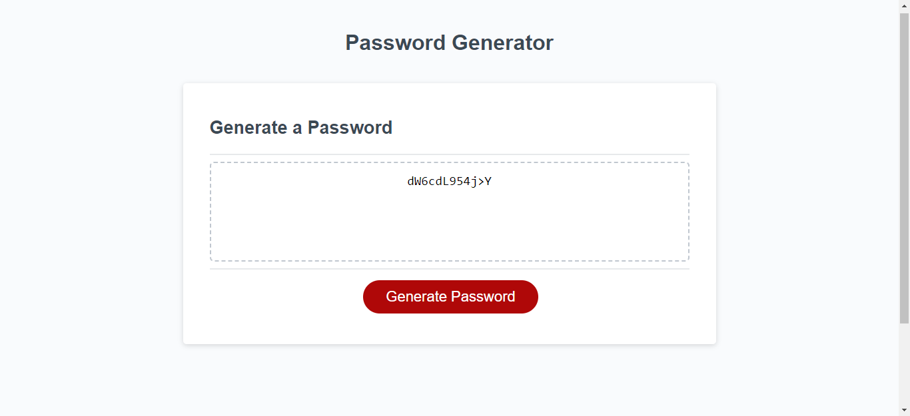

# Random-password-generator

## Description

This code will create a random password following user input criteria.
The user can choose the password length and the use or not of the following characters:
  - Uppercases
  - Lowercases
  - Numeric values
  - Special characters

The password is then generated and displayed on the page.

## Table of Contents (Optional)

If your README is long, add a table of contents to make it easy for users to find what they need.

- [Usage](#usage)
- [Credits](#credits)
- [Future version](#versions)

## Usage

To start, simply hit the "Generate password" button and follow the prompts.
The password will be displayed in the text area, copy and paste wherever you want.

## Credits

List your collaborators, if any, with links to their GitHub profiles.

If you used any third-party assets that require attribution, list the creators with links to their primary web presence in this section.

If you followed tutorials, include links to those here as well.

## Versions

This is the Version 1.0.

The next version will reduce the amount of unecessary tim ethe loop runs.
Minor HTML/CSS changes

